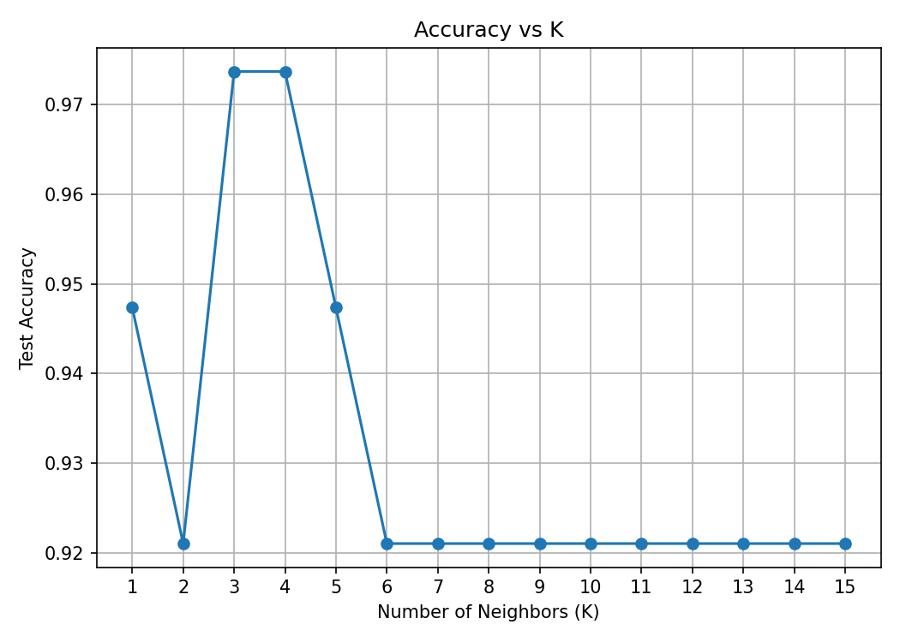
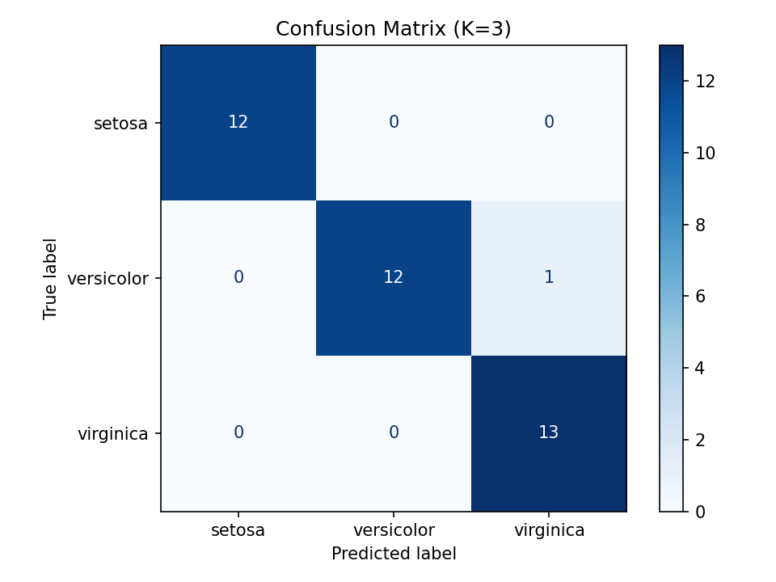
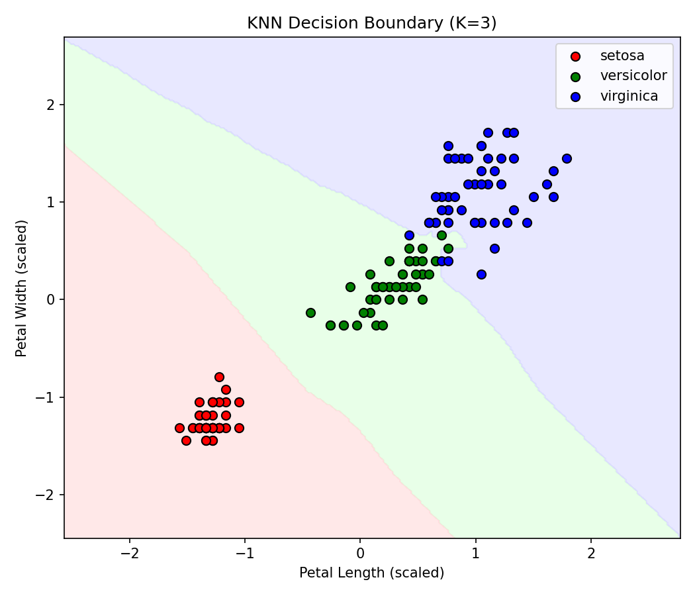

# KNN Classification (Iris Dataset)

A simple, from-scratch-in-scikit-learn walkthrough of K-Nearest Neighbors
for classification. Uses the classic Iris dataset since it's small,
clean, and great for visualizing decision boundaries.

## What this covers

1. Loading and exploring the data
2. Splitting into train/test sets and scaling features
3. Testing multiple values of K to see how accuracy changes
4. Evaluating the final model with accuracy + a confusion matrix
5. Plotting the decision boundary in 2D

## Tools

- scikit-learn
- pandas
- matplotlib

## How to run

```bash
pip install scikit-learn pandas matplotlib
python knn_classification.py
```

This will print the results to the console and save three plots:
`accuracy_vs_k.png`, `confusion_matrix.png`, and `decision_boundary.png`.

## Results

**Accuracy for different K values:**

| K | Accuracy |
|---|----------|
| 1 | 0.9474 |
| 2 | 0.9211 |
| 3 | 0.9737 |
| 4 | 0.9737 |
| 5 | 0.9474 |
| 6–15 | 0.9211 |

Best K found: **3** (accuracy = 0.9737)



**Confusion matrix (K=3):**

```
[[12  0  0]
 [ 0 12  1]
 [ 0  0 13]]
```



**Decision boundary (K=3):**



## Notes

- Only petal length and petal width are used as features so the decision
  boundary can be visualized in 2D. You can swap in all 4 features if
  you don't need the plot.
- Features are scaled with `StandardScaler` before fitting, since KNN
  is distance-based and sensitive to feature scale.
